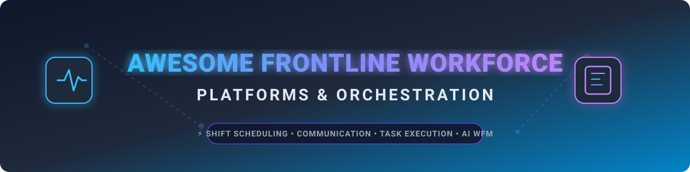

# 🚀 Awesome Frontline Workforce Platform

  
  
  
  

## 🌟 Overview & Top Frontline Workforce Platforms

A curated, SEO-optimized collection of leading platforms and software suites for **deskless / frontline workforce management** — covering **employee communication 💬**, **task execution 📋**, **AI shift scheduling 📅**, **microlearning 🎓**, **audits 🔍**, and **operational orchestration ⚡** for retail, hospitality, manufacturing, logistics, healthcare, and field operations teams.

> **Primary focus:** Open-source workforce management software, shift rostering libraries, and self-hosted employee communication tools. Commercial SaaS platforms are documented with explicit pricing and company valuation/revenue metrics for benchmark context.

---

## 💼 SaaS / Hosted Platforms

Below is a curated comparison table of commercial frontline workforce platforms, sorted in descending order by company financial scale (Market Capitalization, Valuation, or Annual Revenue).

| Platform | Market Scale / Revenue / Valuation (Descending) 📊 | Description | Key Focus | Pricing | Free Tier / Free Trial Limits |
|----------|----------------------------------------------------|-------------|-----------|---------|-------------------------------|
| **[Zebra Reflexis](https://www.zebra.com/)** 🏢 | **$18.5 Billion** (Public Market Cap, Zebra Tech; $5.4B Revenue) | Intelligent labor and task management for retail and multi-site operations. Strong scheduling, real-time tasking, and labor optimization that reduces manager time and improves store productivity. | Retail labor & task management | Workforce Scheduler module starts at ~$62,500/year | No free trial available (demo upon request) |
| **[Beekeeper](https://www.beekeeper.io/)** 🐝 | **$1.0+ Billion** (Valuation via LumApps Group merger; $150M ARR) | Frontline success / communication platform for deskless workers. Secure messaging, announcements, workflows, and integrations tailored to hospitality, retail, manufacturing, and construction. | Frontline communication & productivity | Essential tier starts at $4 per user/month | 14-day free trial |
| **[Staffbase](https://staffbase.com/)** 📢 | **$1.1 Billion** (Unicorn Valuation; ~$193M ARR) | Employee communication and experience platform with strong publishing, intranet, and multichannel capabilities, often used for large distributed workforces. | Enterprise employee communications | Enterprise rates start at ~$8 per user/month | No standard self-service free trial (demo upon request) |
| **[Connecteam](https://connecteam.com/)** 📱 | **$800 Million** (Series C Valuation; ~$56M+ ARR) | Mobile-first workforce management for deskless teams — scheduling, time clock, task management, communication, and training in one app. Popular with SMBs and field operations. | All-in-one mobile WFM | Basic plan starts at $29/month (covers first 30 users, +$0.80/user/month beyond 30) | Free Forever Small Business Plan (up to 10 users); 14-day free trial for paid hubs |
| **[WorkJam](https://www.workjam.com/)** ⚡ | **$500+ Million** (Series D Valuation; ~$60M ARR) | Frontline AI & workforce orchestration platform that connects enterprise systems to deskless teams. Modules for communications, task management, audits, learning, and execution with high task-completion rates. | Frontline execution & AI workflows | Frontline Connect packages start at $799/month (up to 500 users) | No free trial available (demo upon request) |
| **[Legion](https://legion.co/)** 🤖 | **~$250+ Million** (Estimated Valuation; AI WFM Growth) | AI-driven workforce management with forecasting, optimized scheduling, employee experience features, and labor compliance tools for service businesses. | AI scheduling & workforce optimization | Standard custom tiers start at ~$10 per user/month | No standard self-service free trial (pilot/demo available upon request) |
| **[YOOBIC](https://www.yoobic.com/)** 🎯 | **~$150+ Million** (Estimated Valuation; Multi-site Retail focus) | Frontline employee engagement platform focused on communication, task management, and microlearning delivered in the flow of work for retail and deskless teams. | Communication + tasks + microlearning | Entry base rates start at $1 per user/month | No free trial available (demo upon request) |
| **[Quinyx](https://www.quinyx.com/)** ⏱️ | **~$100+ Million** (Series B/C Valuation; AI Demand WFM) | AI-powered workforce management suite with demand forecasting, automated scheduling, labor optimization, and employee self-service for retail, hospitality, and healthcare. | AI WFM & demand-driven scheduling | Entry plans start at $5 - $8 per user/month | No free trial available (demo upon request) |
| **[Axonify](https://www.axonify.com/)** 🎓 | **~$51.8 Million** (Valuation estimate; ~$26.5M ARR) | Frontline learning platform specializing in microlearning, gamification, and knowledge reinforcement for retail, grocery, and manufacturing teams. | Microlearning & frontline training | Custom enterprise rates start at ~$10 per user/month | No free trial available (demo upon request) |
| **[Flip](https://www.getflip.com/)** 🔄 | **~$40+ Million** (Growth Valuation; Enterprise Deskless App) | AI-native frontline employee experience platform combining communication, HR self-service, task management, and operational tools for both deskless and desk-based workers. | Unified frontline + desk experience | Growth packages for small teams start at €4,950/year (up to 300 users) | No free trial available (demo upon request) |

---

## 🔓 Open-Source Softwares & Frameworks

Fully featured, enterprise-grade open-source frontline workforce platforms (matching the full breadth of communication + tasking + AI scheduling + mobile execution of commercial products) remain scarce. Useful open-source building blocks exist for scheduling/rostering, internal communication, HR modules, optimization solvers, and task management.

Repositories below are decorated with GitHub star badges (linking directly to each project's stargazers page) and sorted in **descending order by star count** ⭐.

### 🛠️ Core Workforce Management, HR & Scheduling Platforms

| Project | GitHub Stars (Descending) ⭐ | Description | License | Key Notes |
|---------|-----------------------------|-------------|---------|-----------|
| **[Odoo Community](https://github.com/odoo/odoo)** |  | Open-source ERP and enterprise suite with built-in modules for employee management, shift attendance, leave tracking, and task execution. | LGPLv3 | Comprehensive operational backbone adaptable for frontline teams |
| **[ERPNext](https://github.com/frappe/erpnext)** |  | Full-featured open-source ERP system featuring human resource management, shift management, expense claims, and attendance tracking. | GPLv3 | Highly customizable open HR and operational backbone |
| **[Frappe HR](https://github.com/frappe/hrms)** |  | Modern open-source HR and payroll platform covering shift rosters, attendance, expense claims, and employee lifecycle management. | MIT | Modern, lightweight open-source HRIS & shift roster system |
| **[Staffjoy Suite / V2](https://github.com/Staffjoy/v2)** |  | Open-source workforce scheduling and management application originally built for shift-based teams. Includes scheduling, assignment algorithms, and microservices. | MIT | Historic and highly influential open WFM codebase |
| **[MASTERPLAN](https://github.com/schorschii/MASTERPLAN)** |  | Web-based open-source workforce management application featuring automated roster algorithms, employee self-service shift swaps, and vacancy management. | GPLv3 | Roster generator & self-service shift swapping portal |
| **[UniTime](https://github.com/UniTime/unitime)** |  | Comprehensive open-source enterprise scheduling system supporting automated timetabling, student/staff scheduling, and event management. | Apache-2.0 | Proven automated timetabling and resource scheduling engine |
| **[pyworkforce](https://github.com/rodrigo-arenas/pyworkforce)** |  | Python library for workforce planning: queue staffing (Erlang models), shift scheduling, rostering, and break optimization with a scikit-learn-style API. | MIT | Ideal for contact-center and demand-driven staffing optimization |
| **[TimeTables](https://github.com/dlsnyder8/TimeTables)** |  | Open-source employee shift scheduling and management application with automatic scheduling, availability input, and multi-group support. | Open Source | Practical employee shift-scheduling application |
| **[team-schedule](https://github.com/aleksandrrudenko/team-schedule)** |  | Open-source 24/7 follow-the-sun scheduling tool for distributed teams with workload balancing, overtime prevention, and on-call rotations. | MIT | Multi-timezone and distributed team scheduling |

---

### 🧩 Specialized Libraries & Communication / Execution Building Blocks

Sorted in descending order by GitHub repository star counts:

| Project | GitHub Stars (Descending) ⭐ | Focus Area | Description |
|---------|-----------------------------|------------|-------------|
| **[Google OR-Tools](https://github.com/google/or-tools)** |  | Scheduling Optimization | Open-source software suite for combinatorial optimization, shift scheduling, vehicle routing, and constraint programming. |
| **[Rocket.Chat](https://github.com/RocketChat/Rocket.Chat)** |  | Frontline Communication | Self-hosted open-source communication platform with channels, live chat, matrix bridge, and mobile apps for field teams. |
| **[Mattermost](https://github.com/mattermost/mattermost-server)** |  | Internal Messaging & Alerts | Open-source secure collaboration and messaging platform designed for distributed, deskless, and security-conscious operations. |
| **[Moodle](https://github.com/moodle/moodle)** |  | Training & Microlearning | Open-source learning management system (LMS) adaptable for mobile frontline training, compliance, and skill certification. |
| **[Taiga](https://github.com/taigaio/taiga-back)** |  | Task Execution & Audits | Open-source project and task management system with intuitive boards and task tracking suitable for operational workflows. |

---

### 💡 Additional Notable Open-Source Tooling Patterns

- **Self-hosted communication stacks** — Combine Mattermost/Rocket.Chat with bots and webhook integrations to approximate frontline messaging, emergency alerts, and broadcast announcements.
- **Custom scheduling engines** — Leverage pyworkforce, Google OR-Tools, or Staffjoy components to build custom demand-driven or rule-based shift schedulers.
- **HRIS foundations** — Deploy Odoo, ERPNext, or Frappe HR as the central system of record for employee profiles, with custom mobile front-ends for deskless workers.
- **Audit & checklist apps** — Utilize lightweight open forms and checklist tools to digitize store inspections, safety audits, and generate automated follow-up tasks.
- **Analytics & dashboards** — Integrate Metabase, Apache Superset, or Grafana for operational visibility into task completion rates, attendance compliance, and labor metrics.
- **Integration layers** — Use open API gateways and automation tools (n8n, Node-RED) to seamlessly connect shift scheduling, communication, and task management systems.

> [!NOTE]  
> Commercial frontline platforms excel at mobile-first experiences tailored to deskless workers, AI-driven forecasting/scheduling, high-adoption communication, in-flow microlearning, photo/video task verification, and deep enterprise system integrations. Open-source alternatives serve as modular building blocks that organizations can customize into production-grade solutions.

---

## ⚡ Quick Start Recommendations

| Operational Goal 🎯 | Recommended Starting Point 🚀 |
|--------------------|------------------------------|
| **Open-source shift scheduling & rostering** | **Odoo Community**, **ERPNext**, **Frappe HR**, or **Staffjoy** |
| **Demand-driven shift optimization & algorithms** | **Google OR-Tools** or **pyworkforce** |
| **Automated roster generation & shift swapping** | **MASTERPLAN** or **UniTime** |
| **Multi-timezone / follow-the-sun scheduling** | **team-schedule** |
| **Self-hosted frontline team communication** | **Mattermost** or **Rocket.Chat** |
| **Open HR + attendance & shift management** | **Frappe HR / ERPNext** or **Odoo Community** |
| **Full frontline execution + AI workflows** | **WorkJam** |
| **Retail labor & store task optimization** | **Zebra Reflexis** |
| **AI demand forecasting & scheduling** | **Quinyx** or **Legion** |
| **Mobile all-in-one for SMBs / field teams** | **Connecteam** |
| **Frontline engagement & messaging focus** | **Beekeeper** or **Flip** |
| **Microlearning for deskless workers** | **Axonify** or **Moodle** |
| **Enterprise employee communications** | **Staffbase** |

---

## 🤝 Contributing

Contributions, corrections, and new open-source projects are welcome!  
Please open an issue or submit a pull request.

---

## 📊 Star History

<a href="https://www.star-history.com/?repos=ishandutta2007%2FAwesome-Frontline-Workforce-Platform&type=date&legend=bottom-right">
<picture>
<source media="(prefers-color-scheme: dark)" srcset="https://api.star-history.com/chart?repos=ishandutta2007/Awesome-Frontline-Workforce-Platform&type=date&theme=dark&legend=bottom-right" stroke-width="2"/>
<source media="(prefers-color-scheme: light)" srcset="https://api.star-history.com/chart?repos=ishandutta2007/Awesome-Frontline-Workforce-Platform&type=date&legend=bottom-right" />

</picture>
</a>

---

**Last updated:** August 2026  
*Documenting open-source software building blocks alongside commercial frontline workforce management platforms.*
